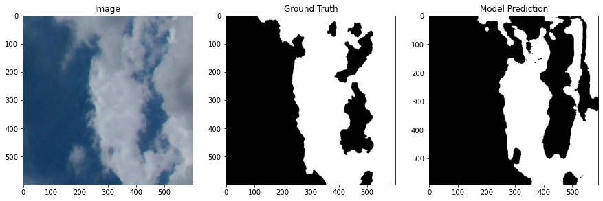

# Binary Semantic Segmentation of Daytime Sky Images

Training a computer vision network to identify clouds in images from the Singapore Whole Sky Imaging Segmentation Database

## **Intro**

The goal of this project is to apply semantic segmentation to images of the sky in order to categorize each pixel as belonging either to a cloud or to the background atmosphere. The dataset used is the Singapore Whole Sky Imaging Segmentation Database found [here](http://vintage.winklerbros.net/swimseg.html). The description reads: 

"The SWIMSEG dataset contains 1013 images of sky/cloud patches, along with their corresponding binary segmentation maps. The ground truth annotation was done in consultation with experts from Singapore Meteorological Services. Representative sample images are shown below.

All images were captured in Singapore using WAHRSIS, a calibrated ground-based whole sky imager, over a period of 22 months from October 2013 to July 2015. Each patch covers about 60-70 degrees of the sky with a resolution of 600x600 pixels."

## **Links**

[Action Gesture Jupyter Notebook](https://github.com/LindstromKyle/Flatiron-Capstone/blob/main/Action/Action.ipynb)  

[Single Frame Jupyter Notebook](https://github.com/LindstromKyle/Flatiron-Capstone/blob/main/SingleFrame/Single_Frame.ipynb)  

[Non Technical Presentation (For video playback check README)](https://github.com/LindstromKyle/Flatiron-Capstone/blob/main/Presentation/Non%20Technical%20Presentation.pdf)  

